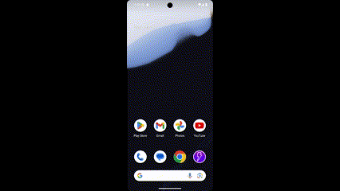
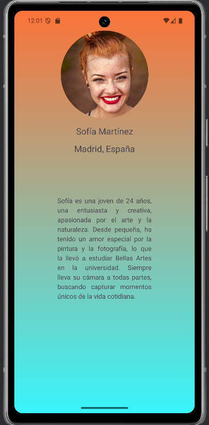

# Proyecto Android con Registro, Login y Main

Este proyecto incluye cuatro actividades principales:

- **SplashActivity**: Pantalla de introducción con animación de transición.
- **LoginActivity**: Permite el inicio de sesión y la opción de registro.
- **SignupActivity**: Contiene un formulario de registro y devuelve al usuario a LoginActivity o MainActivity.
- **MainActivity**: Pantalla principal con un **Toolbar** que incluye íconos accionables, opciones de navegación y funcionalidades dinámicas.
- **MainActivityTollBar**: Otra forma de incorporar **Toolbar** con animación importada de lotti.
- **Profile**: Perfil personal con imagen circular e incorporada con un **Glide**.

---

## **SplashActivity**

El **SplashActivity** muestra una animación de transición al iniciar la aplicación.  
Esta animación, creada en XML, despliega un movimiento suave que presenta el logotipo de la aplicación.

### **Características**
- **Tipo de animación:** Translación desde el centro de la pantalla a la derecha.
- **Duración:** 2 segundos.
- **Diseño:** Minimalista, para captar la atención del usuario.

### **Vista previa de la animación**

---

## **LoginActivity**

El **LoginActivity** permite al usuario iniciar sesión con un diseño moderno y funcional.

### **Diseño**
- **Fondo:** Gradiente con una imagen superpuesta que combina estética y funcionalidad.
- **Campos de texto (TextViews):**
    - Incluyen íconos representativos dentro de cada campo.
    - El campo de contraseña tiene la opción **passwordToggleEnabled**, lo que permite mostrar u ocultar la contraseña.
- **Botones:**
    - Personalizados con estilos únicos.
    - El botón de "Login" redirige al usuario al **MainActivity**.
    - El botón "Sign Up" redirige al **SignupActivity**.

### **Captura de pantalla**

---

## **SignupActivity**

La **SignupActivity** utiliza un diseño similar al del **LoginActivity**, con pequeños ajustes para optimizar el registro del usuario.

### **Características**
- **Fondo:** Imagen con un atributo **alpha**, que reduce la opacidad y permite destacar los campos del formulario.
- **Campos adicionales:** Se incluye un campo para el correo electrónico, además de los tradicionales.
- **Botones:**
    - "Registrar" para completar el registro.
    - "Cancelar" para volver al **LoginActivity**.

### **Captura de pantalla**

---

## **MainActivity**

El **MainActivity** es la pantalla principal de la aplicación, diseñada para ofrecer una experiencia dinámica e interactiva.

### **Características del Toolbar**
1. **Nombre de la aplicación:** En la parte izquierda del toolbar.
2. **Íconos de acción:**
    - **Icono de mensaje:** Muestra un **SnackBar** con el texto "Mensaje enviado". Al pulsar "Undo", cancela la acción.
    - **Menú desplegable:** Incluye opciones como:
        - **Perfil.**
        - **Registro (SignupActivity).**
        - **Login (LoginActivity).**
        - **Logout:** Muestra un **AlertDialog** para confirmar la acción.

### **Captura del Toolbar con SnackBar y menú**

### **Contenido principal**
- **WebView:** Carga imágenes desde Internet.
- **SwipeRefreshLayout:** Permite al usuario actualizar el contenido del WebView deslizando hacia abajo.

### **Gif de WebView y SwipeRefreshLayout**

---

## **MainActivityTollBar**

El **MainActivityTollBar** es una pantalla principal secundaria creada de forma distinta e incorpora una animacion **lotti** en el tollbar.
Además, el toolbar fue creado desde otro layout incluido con el atributo **include** en el layout.

### **Características del Toolbar**
1. **Nombre de la aplicación:** En la parte izquierda del toolbar.
2. **Íconos de acción:**
    - **Icono de flecha:** Regresa al login.
    - **Icono de mensaje:** Muestra un **SnackBar** con el texto "Mensaje enviado". Al pulsar "Undo", cancela la acción.
    - **Menú desplegable:** Incluye opciones como:
        - **Perfil.**
        - **Registro (SignupActivity).**
        - **Login (LoginActivity).**
        - **Logout:** Muestra un **AlertDialog** para confirmar la acción.

### **Captura del Toolbar**

---
## **Profile**

El **Profile** cuenta con una imagen de forma circular y cargada desde un **Glide**. Además tiene el texto justificado.

---

## **Navegación entre actividades**
- **SplashActivity** → LoginActivity.
- **LoginActivity:**
    - Si el inicio de sesión es exitoso → MainActivity.
    - Opción de registro → SignupActivity.
- **SignupActivity:**
    - Si el registro es exitoso → MainActivity.
    - Opción de cancelar → LoginActivity.
- **MainActivity:**
    - Opción de cerrar sesión → LoginActivity.
- **MainActivityTollBar:**
    - Opcion volver al main principal.

---

## **Vista general de funcionalidades**
| Actividad          | Características principales                                         |
|--------------------|---------------------------------------------------------------------|
| **SplashActivity** | Animación de transición con diseño atractivo.                       |
| **LoginActivity**  | Fondo dinámico, campos personalizados, y funcionalidad de login.    |
| **SignupActivity** | Diseño similar al login con campos adicionales y opciones de acción. |
| **MainActivity**   | Toolbar dinámico, SnackBar, menú desplegable, y WebView interactivo. |
|**MainActivityTollBar**| Toolbar incorporado desde otro layaou "include".                    |

